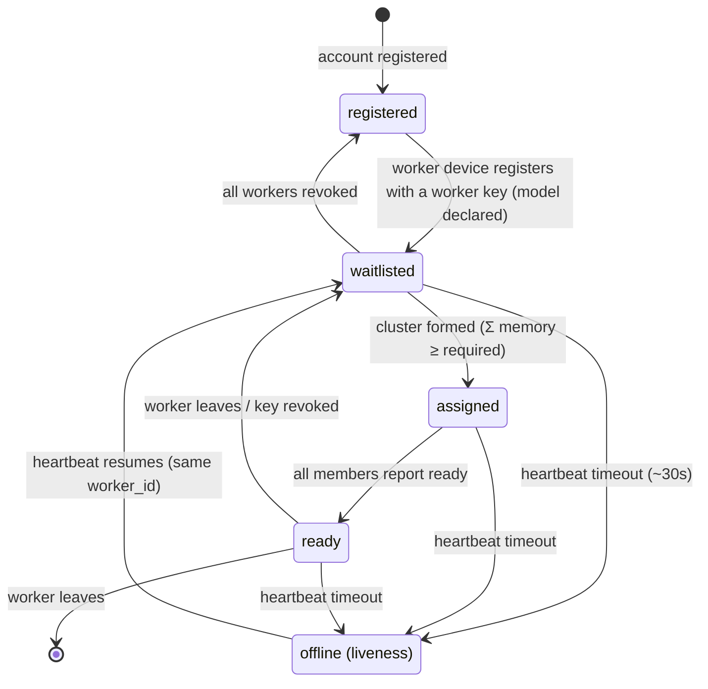

# prima-pool protocol — overview

**Status:** v0 draft — negotiation only. Not yet implemented.

This document defines how a **worker device** talks to the **prima-pool control plane**
(pool server), and how that negotiation results in a **WireGuard tunnel** between cluster
members. The wire protocol is a standard HTTPS/WSS API: plain HTTP/JSON + WebSocket push, with
WireGuard only being established *after* negotiation succeeds.

## Communication planes

| Plane      | Traffic                                       | Transport        | Auth                          | Requirements                    |
| ---------- | --------------------------------------------- | ---------------- | ----------------------------- | ------------------------------- |
| **Control**| registration, workers, assignment, heartbeats  | HTTPS + WSS (JSON) | scoped API key (Bearer)     | reliable, low-frequency, stateless-ish |
| **Data**   | prima.cpp inference traffic between members   | WireGuard         | WG keys (issued at negotiation) | low latency, high throughput, only between negotiated peers |
| **Billing**| usage reports, balances                       | HTTPS (same as control) | API key              | tamper-evident; **out of v0 scope** (see [usage-and-accounting.md](usage-and-accounting.md)) |

Key rule: **WireGuard is never in the negotiation path.** Workers first prove who they are and
what they can serve over HTTPS; only then does the server hand out cluster/WireGuard configuration.
This keeps the control plane simple, auditable, and debuggable, and limits the WG attack surface to
authenticated, negotiated peers.

## Roles

- **Account** — a pure identity: a username and a password. An account is **not tied to any
  hardware**. It owns scoped API keys and (in the future) the billing balance. An account can own
  multiple workers.
- **Scoped API key** — a credential issued by an account, restricted to a single scope:
  - **worker scope** — lets a device register as a worker and provide compute.
  - **user scope** — lets a client send inference requests (the request API itself is out of v0
    scope; see [usage-and-accounting.md](usage-and-accounting.md)).
- **Worker** — a distinct device entity that logs in with a **worker-scoped key**. It is
  model-specific: in v0, **one device == one worker**, so a worker has exactly one model. A worker
  declares `memory_allocated_mb` for that model and sits on the model's waitlist. It is what
  actually joins clusters. Earnings accrue to the **account** that owns the worker key.
- **Worker liveness** — a transient, heartbeat-driven property, **orthogonal to registration**. A
  worker that stops heartbeating is marked `offline`: its **key stays valid** and its registration
  persists, but it is **removed from the waitlist** (it can't be assigned work while offline). When
  it heartbeats again, it is **re-added** to the waitlist with the same `worker_id` — no
  re-registration.
- **Pool server** — the control plane. Issues identities, maintains per-model waitlists, forms
  clusters, and (in relay fallback) orchestrates connectivity.
- **Relay node** — a dedicated, publicly reachable WireGuard relay. Not part of the control plane;
  it only forwards cluster traffic when a direct path between members is unavailable. Relays are
  separate machines, operated independently of the pool server.

## Scope (v0)

| In scope                                                  | Out of scope (v1+)                                   |
| --------------------------------------------------------- | ---------------------------------------------------- |
| Account registration (username + password)                | Usage reporting & accounting endpoints               |
| Scoped API key creation (worker / user)                   | Server-initiated eviction / rebalancing (churn)      |
| Worker device registration via worker key                 | NAT traversal beyond WG + STUN self-report           |
| Per-model waitlists, cluster formation                    | Signed/verifiable usage reports                      |
| Cluster assignment (WS push) + config retrieval           | Payment / billing                                   |
| WireGuard tunnel bring-up (direct-first, relay fallback)  | Model registry management (admin)                    |
| Readiness handshake, heartbeat, liveness                  | Multiple workers (models) per device                 |
| Offline workers: removed from waitlist, re-added on return | The user-facing request API (only the key scope)    |
| Worker-initiated leave                                    |                                                     |

## Worker lifecycle

**Liveness is orthogonal to registration.** An offline worker keeps its `worker_id`, its key, and
its registration; it is simply out of the scheduling picture until it heartbeats again.

Every state is observable via `GET /v1/workers/{id}/state`, so a daemon can always recover.

## Trust model (v0)

- The worker generates its own WireGuard keypair locally and **never uploads the private key**.
  Revocation is therefore: drop the peer from every member's config and evict.
- A **scoped API key** authenticates control-plane calls (Bearer token). A worker key can only
  register/operate a worker; it cannot manage the account or send requests.
- **Key revocation is distinct from going offline.** Revoking a key invalidates the credential
  (permanent). Going offline is transient: the key stays valid, the worker is just removed from the
  waitlist until it returns.
- `memory_allocated_mb` is **self-declared** in v0. Verifying it against hardware is an open
  problem.
- Relay mode means the relay **can observe cluster traffic** — workers are told when they are on
  relay vs direct (the relay appears in their config as a peer).
- Usage reports are plain (unsigned) in v0; this is a known limitation.

## Conventions

- API is versioned: `/v1/...`. Breaking changes bump the major version.
- All timestamps are RFC 3339 UTC.
- Errors use RFC 7807 `application/problem+json` (see [negotiation.md](negotiation.md#8-errors)).
- Suggested default cadences live in [negotiation.md](negotiation.md#cadence-and-timeouts).
- **Transport**: all control-plane traffic is HTTPS/WSS — credentials, API keys, and session
  tokens must never transit plaintext. There is no HTTP fallback.
