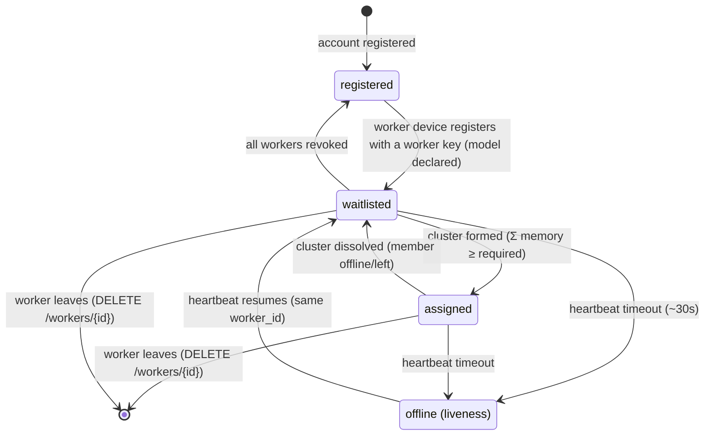

# prima-pool protocol — overview

**Status:** v0 — negotiation + inference proxy implemented (see `prima-pool-server`).

This document defines how a **worker device** talks to the **prima-pool control plane**
(pool server), and how that negotiation results in a **WireGuard tunnel** between cluster
members. The wire protocol is a standard HTTPS/WSS API: plain HTTP/JSON + WebSocket push, with
WireGuard only being established *after* negotiation succeeds.

## Communication planes

| Plane      | Traffic                                       | Transport        | Auth                          | Requirements                    |
| ---------- | --------------------------------------------- | ---------------- | ----------------------------- | ------------------------------- |
| **Control**| registration, workers, assignment, heartbeats  | HTTPS + WSS (JSON) | scoped API key (Bearer)     | reliable, low-frequency, stateless-ish |
| **Data**   | prima.cpp inference traffic between members   | WireGuard         | WG keys (issued at negotiation) | low latency, high throughput, only between negotiated peers |
| **Billing**| usage reports, balances                       | HTTPS (same as control) | API key              | user-side usage + balances implemented; worker crediting + debit-on-use are design-only (see [usage-and-accounting.md](usage-and-accounting.md) and [pay-per-use.md](pay-per-use.md)) |

Key rule: **WireGuard is never in the negotiation path.** Workers first prove who they are and
what they can serve over HTTPS; only then does the server hand out cluster/WireGuard configuration.
This keeps the control plane simple, auditable, and debuggable, and limits the WG attack surface to
authenticated, negotiated peers.

## Roles

| Role          | In one line                                                              | Details                          |
| ------------- | ------------------------------------------------------------------------ | -------------------------------- |
| **Account**   | An identity (username + password) at one of two levels — **admin** (manages accounts) or **user** (works/uses compute) — owning scoped API keys | [negotiation.md](negotiation.md#1-account-permissions-adminuser) |
| **API key**   | A credential scoped to `worker` (provide compute) or `user` (send requests) | [negotiation.md](negotiation.md#4-scoped-api-keys) |
| **Worker**    | A device that logs in with a worker key, declares a model, joins clusters | [negotiation.md](negotiation.md#5-worker-device-registration) |
| **Liveness**  | `online`/`offline`, heartbeat-driven, orthogonal to registration          | [tunnel.md](tunnel.md#2-health-tracking-server-side) |
| **Cluster**   | An *ordered* group of workers (a ring) serving one model                  | [assignment.md](assignment.md#3-cluster-config-wireguard) |
| **Pool server**| The control plane: identities, waitlists, cluster formation, relay orchestration | [negotiation.md](negotiation.md#6-waitlist-and-cluster-formation) |
| **Relay node**| A dedicated, publicly reachable WG relay for NAT'd members                 | [tunnel.md](tunnel.md#4-direct-first-relay-fallback-tunnel-details) |

## Scope (v0)

| In scope                                                  | Out of scope (v1+)                                   |
| --------------------------------------------------------- | ---------------------------------------------------- |
| Account registration (username + password)                | Worker-side crediting & debit-on-use (design: [pay-per-use.md](pay-per-use.md)) |
| **Account permissions (admin/user + can_work/can_use/ban)** |                                                     |
| Scoped API key creation (worker / user)                   | Server-initiated eviction / rebalancing (churn)      |
| Worker device registration via worker key                 | NAT traversal beyond WG + STUN self-report           |
| Per-model waitlists, cluster formation                    | Signed/verifiable usage reports                      |
| Cluster assignment (WS push) + config retrieval           | Pricing tiers / rate tables                         |
| WireGuard tunnel bring-up (direct-first, relay fallback)  |                                                      |
| Readiness handshake, heartbeat, liveness                  |                                                      |
| Usage reporting & accounting (user-side)                  |                                                      |
| Per-account balance (state + admin controls)              |                                                      |
| Multiple workers per account (one device == one worker)   |                                                      |
| Offline workers: removed from waitlist, re-added on return |                                                     |
| Worker-initiated leave                                    |                                                     |
| **Inference proxy** (`POST /v1/chat/completions` → head)  |                                                     |

> **Inference proxy (option A):** the server may join each cluster's WireGuard
> network (as a peer marked `role: "server"`) and proxy OpenAI-compatible
> requests to the head's `llama-server`. This is gated by
> `PRIMA_POOL_SERVER_JOIN_WG`. The server peer is **not** a ring member — clients
> must exclude it from ring topology computation.

## Worker lifecycle

**Liveness is orthogonal to registration.** An offline worker keeps its `worker_id`, its key, and
its registration; it is simply out of the scheduling picture until it heartbeats again.

**Cluster dissolution**: a worker in an active cluster that goes offline (or leaves) dissolves the
whole cluster — all members return to the waitlist, because the model no longer fits in the
remaining members' memory. Details in
[assignment.md](assignment.md#cluster-dissolution).

Every state is observable via `GET /v1/workers/{id}/state`, so a daemon can always recover.

## Trust model (v0)

- The worker generates its own WireGuard keypair locally and **never uploads the private key**.
  Revocation is therefore: drop the peer from every member's config and evict.
- **Key revocation is distinct from going offline.** Revoking a key invalidates the credential
  (permanent). Going offline is transient: the key stays valid, the worker is just removed from the
  waitlist until it returns.
- `memory_allocated_mb` is **self-declared** in v0 (see
  [usage-and-accounting.md](usage-and-accounting.md#5-trust-self-declared-memory)).
- Relay mode means the relay **can observe cluster traffic** — workers are told when they are on
  relay vs direct (the relay appears in their config as a peer).

## Conventions

- API is versioned: `/v1/...`. Breaking changes bump the major version.
- All timestamps are RFC 3339 UTC.
- Errors use RFC 7807 `application/problem+json` (see [negotiation.md](negotiation.md#9-errors)).
- Suggested default cadences live in [negotiation.md](negotiation.md#7-cadence-and-timeouts-suggested-defaults).
- **Transport**: all control-plane traffic is HTTPS/WSS — credentials, API keys, and session
  tokens must never transit plaintext. There is no HTTP fallback.
